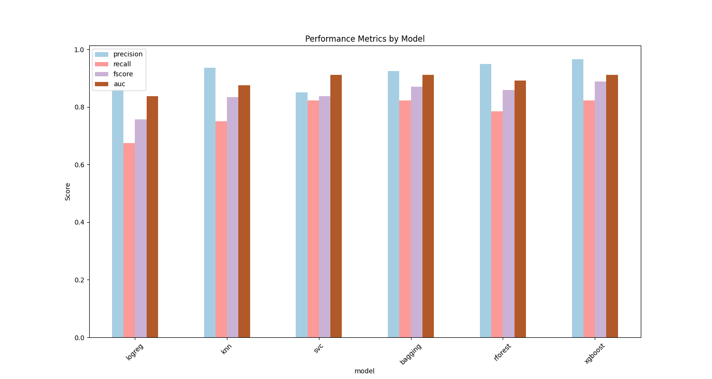

# fraudulent-transactions

# Credit Card Fraud Detection Project

## Overview

This project is a comprehensive analysis of a credit card fraud detection dataset. The primary goal is to build and evaluate machine learning models to accurately identify fraudulent transactions, with a focus on metrics like Precision, Recall, and F1-score due to the highly imbalanced nature of the data.

The project is structured in a modular fashion to demonstrate best practices in data science project management and software engineering.

## Key Features

- **End-to-End Pipeline:** From data acquisition and preprocessing to model training and interpretation.
- **Handling Imbalanced Data:** Class weighting is used in some models to address the severe class imbalance in the dataset.
- **Comprehensive Model Comparison:** Multiple models (Logistic Regression, KNN, SVC, Bagging Trees, Random Forest, XGBoost) are trained and their performance is compared.
- **Model Interpretability:** Permutation Feature Importance is used to explain the predictions of the final model on unseen data.

## Key Insights and Findings

* **Top-Performing Model:** The XGBoost Classifier emerged as the best-performing model, achieving a high F1-score of approximately 0.86. 

* **Key Predictive Features:** Permutation Feature Importance revealed that the engineered features **V14** and **V10** were the most influential in the model's ability to detect fraud. This provides critical insight into the underlying patterns driving the model's predictions.


## Setup and Installation

1.  **Clone the repository:**
    ```bash
    git clone [https://github.com/adrian-pbustamante/fraudulent_transactions.git](https://github.com/adrian-pbustamante/fraudulent_transactions.git)
    cd fraudulent_transactions
    ```


2.  **Install the required packages:**
    ```bash
    pip install -r requirements.txt
    ```

3.  **Run the analysis:**
    ```bash
    python src/main.py
    ```
    The `main.py` script will automatically download the data from KaggleHub, run the entire analysis pipeline, and print the results to the console.

## Model Comparison

